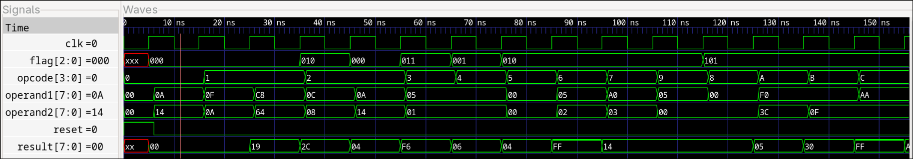

# 8-bit ALU
---
8-bit ALU implementation on verilog for FPGA elective's assignment-1. This implementation ALU supports arithmetic,logical and shift operation and has three flags {Zero, Carry, Parity} to denote the state of obtained results.

**Name**: Prashant Neupane
**Roll No**: 079BEI025

## Features
- Support arithmetic operations: Addition, Subtraction, Increment and Decrement
- Support logical operation: AND, OR, XOR, Compliment
- Support shift operation: Left Shift, Right Shift
- Also support a NOP instruction for delay purpose, Get Flag instruction to retrieve flag, and Set flag to set the set flag with desired value.

## Opcode
| Opcode | Mnemonic |
|--------|----------|
| 0000   | NOP      |
| 0001   | ADD      |
| 0010   | SUB      |
| 0011   | INC      |
| 0100   | DEC      |
| 0101   | CMP      |
| 0110   | LSHIFT   |
| 0111   | RSHIFT   |
| 1000   | Get Flag |
| 1001   | Set Flag |
| 1010   | AND      |
| 1011   | OR       |
| 1100   | XOR      |

## ALU Operation
ALU takes two operand: operand1 and operand2 as input to operate on. If the instruction only requires a single operand as such in INC,DEC, CMP, it will operate on operand1 only. In case of shift operations, operand1 will be shifted and operand2 will provide the number of bit to be shifted (0-7). The shift operation was implemented using barrel shifter, one for left shift and one for right shift. Three stage barrel shifter is implemented using 2x1 MUX, ternary operators are used instead of MUX.

Flags are updated after each ALU operation. All arithmetic operation change all three flags but other operation wont change any flag at all. 

For uniary operations like increment, decrement, ALU will operate only on operand1.

## Result 
| Time (ns) | Opcode | Operation | Operand1 | Operand2 | Expected Result | Actual Result | Flag (Z,C,P) | Status |
|-----------|:------:|-----------|---------:|---------:|----------------:|--------------:|:------------:|:------:|
| 6000   | `0000` | Reset | 0   | 0   | 0   | 0   | `000` | ✅ |
| 16000  | `0000` | NOP | 10  | 20  | 0 (unchanged) | 0   | `000` | ✅ |
| 26000  | `0001` | ADD | 15  | 10  | 25  | 25  | `000` | ✅ |
| 36000  | `0001` | ADD | 200 | 100 | 44  | 44  | `010` | ✅ |
| 46000  | `0010` | SUB | 12  | 8   | 4   | 4   | `000` | ✅ |
| 56000  | `0010` | SUB | 10  | 20  | 246 | 246 | `011` | ✅ |
| 66000  | `0011` | INC | 5   | 1   | 6   | 6   | `001` | ✅ |
| 76000  | `0100` | DEC | 5   | 1   | 4   | 4   | `010` | ✅ |
| 86000  | `0101` | Complement | 0   | 0   | 255 | 255 | `010` | ✅ |
| 96000  | `0110` | Left Shift | 5   | 2   | 20  | 20  | `010` | ✅ |
| 106000 | `0111` | Right Shift | 160 | 3   | 20  | 20  | `010` | ✅ |
| 116000 | `1001` | Set Flag | 5   | 0   | Result unchanged | 20 | `101` | ✅ |
| 126000 | `1000` | Get Flag | 0   | 0   | 5   | 5   | `101` | ✅ |
| 136000 | `1010` | AND | 240 | 60  | 48  | 48  | `101` | ✅ |
| 146000 | `1011` | OR | 240 | 15  | 255 | 255 | `101` | ✅ |
| 156000 | `1100` | XOR | 170 | 15  | 165 | 165 | `101` | ✅ |

